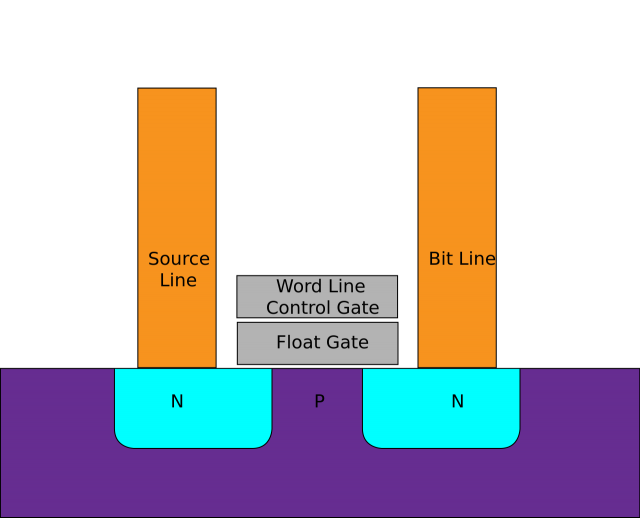
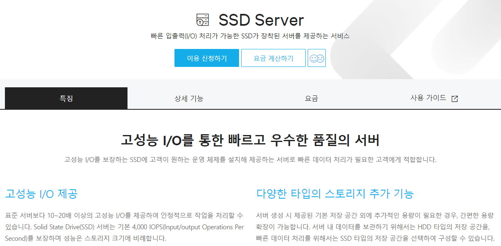

# HDD 와 SDD 차이

- assigned : @unchaptered
- created by : `2022-07-18`
- updated by : `2022-07-20`

## 1. HDD 란?

플래터, 자기 디스크, 라는 판에 정보를 저장시킵니다.

정보가 저장되는 방식은 `자기 배열` 이라는 독특한 방식을 사용하고 있습니다.

이러한 정보에 대해서 읽기/쓰기 작업은 `Head` 라는 친구가 진행하고 있습니다.

`Head` 는 플래터 판이 지정된 위치로 이동하였다는 입력값을 받으면, 1nmm 떨어져있는 플래터 판의 자기 배열을 변형 시키게 됩니다.

물리적 방식의 변형이 있기 때문에, 읽기/쓰기 작업의 속도가 명확하고 다수의 `Head` 와 이에 연결되어 있는 `Actuactor Arm` 을 배치하는 것으로 한계를 극복하였습니다.

> 사진 출처 : [Extreme Tech - How do SSD Work](https://www.extremetech.com/extreme/210492-extremetech-explains-how-do-ssds-work)

### 1.1. HDD 의 장점이란?

HDD 의 장점은 `공간 및 가격 가성비` 가 높다는 점입니다.

기본적으로 자기배열을 기록할 수 있는 플래터 판 만 있다면, 그 크기를 얼마든지 늘릴 수 있습니다.

따라서, PC 의 세계적 확산에 큰 기여를 한 물건이라고 생각합니다.

> 과거의 플로피 디스크(5 ~ 25 MB 이하만 저장하던 것을 생각 해본다면...)

### 1.2. HDD 의 단점이란?

HDD 의 단점은 모두 **물리적 기계 장치** 라는 것에서 발생합니다.

플래터 판이 회전하는 데에서 `소음 및 발열 현상` 이 일어날 수 있습니다.

`Actuator Arm - Head` 과 `Plater` 의 거리가 매우 가깝기 때문에 마찰 손상이 발생할 수 있습니다.

- 갑작스러운 전원 중단에 따른 Platter 판에 스크래치 손상
- 외부의 물리적 충격에 의한 내부 부속품(Platter etc...) 의 파손 및 변형

또한, 다수의 `Platter` 를 동시 읽기/쓰기 하는 구조 이기 때문에 연관된 데이터들이 서로 흩어지는 현상이 발생할 수 있습니다.

- 주기적으로 `디스크 조각 모음` 등을 하여 문제를 해결하여야 함

## 2. SDD 란?

Solid Sate Drive 의 약자입니다.

HDD 와는 달리 `동적 기계 장치` 나 회전하는 `Platter` 에 의존하지 않기 떄문에 명확한 차이가 존재합니다.

데이터는 `NAND Flash Pools` 라는 부품에 저장이 되게 됩니다.

> NAND FLash Pool 이란?
>
> SSD 의 기능 향상을 위해서 기준량의 NAND FLash Memory 를 집합시켜놓은 구성체.

내부 구성품인, NAND Flash 는 데이터를 전기를 이용해서 저장하게 됩니다.

더 정확히는 본인이 가지고 있는 `Floating Gate Transister` 에 정보를 저장하게 됩니다.

> 읽기/쓰기 과정에서는 전기를 사용하게 되는데 이 부분이 특이합니다.
> 
> 일반적으로 전자 방식의 메모리는 `잠시 정보를 저장` 하는 용도로 사용되며, `휘발성 메모리` 라고 불립니다.
>
> 하지만, NAND FLash 는 전기를 항상 유지하고 있기 때문에 정보가 비휘발성을 띄게 됩니다.

이러한 NAND FLash 는 하나의 행을 구성하며 `Independent Page` 를 구성하게 되며, `Page` 의 크기는 일반적으로 2K, 4K, 8K 또는 16K 입니다.

이러한 `Page` 들은 행 방향의 수직 방향인 열 방향으로 전개되어 하나의 격자를 구성하며, 이러한 그리드 구조로 형성된 대상을 `Block` 이라고 부르며, 일반적으로 256KB 부터 4MB 의 크기를 가지게 됩니다.

> 사진 출처 : [Extreme Tech - How do SSD Work](https://www.extremetech.com/extreme/210492-extremetech-explains-how-do-ssds-work)

### 2.1. SSD 의 장점이란?

SSD 는 기본적으로 전기를 이용한 일련의 저장방식을 사용하고 있습니다.

대중적으로 사용되는 HDD 의 `Flatter`, `Actuator Arm - Head` 로 이루어진 기계장치에 반해, `FLoat Gate Transitor` 가 정보를 교류하는 속도는 압도적으로 빠를 수밖에 없습니다.

또한, 기계장치가 아니기 때문에 `온도, 습도 및 물리적 외부 충격` 에도 매우 강한 모습을 보여주고 있습니다.

### 2.2. SSD 의 단점이란?

기본적으로 SSD 는 다량의 반도체가 필요한 한계를 가지고 있습니다.

따라서 그 용량을 늘리는데 한계가 명확하며 많은 비용적 한계를 동반합니다.

즉, `가격 및 공간 가성비` 가 안좋은 것이 단점입니다.

## 3. 표로 보는 간단한 차이점

가격 및 저장 크기를 제외한 모든 항목에서 SSD 가 뛰어납니다.

| 항목 | SDD | HDD |
| :--- | :-- | :-- |
| 가격 | 비쌈 | 비교적 저렴한 편 |
| 저장 크기 | 보통 | 높음 |
| 부팅 속도 | 5 - 10 초 | 30 - 40 초 |
| 소음 여부 | - | 존재 |
| 진동 여부 | - | 존재 |
| 열 발생량 | - | 존재 |
| 처리 속도 | 200 ~ 550 MB/s | 50 ~ 120 MB/s |

## 4. 산업에서 어디에 쓰일까?

마지막으로, 개발자를 준비하고 있는 입장에서 생겨났던 간단한 궁금증 들을 남겨 보았습니다.

### 4.1. 산업에서의 SSD

`AWS EC2 인스턴스` 와 `NCP 의 SSD Server` 에서 SSD 를 사용한 대용량 I/O 특화 서버를 지원하고 있는 것을 볼 수 있었습니다.

## References

- [Transcend - SSD와 하드디스크의 차이는 무엇인가요? 또한 SSD의 장점이 무엇인지 궁금합니다.](https://kr.transcend-info.com/Support/FAQ-462#:~:text=SSD%EC%99%80%20%ED%95%98%EB%93%9C%EB%94%94%EC%8A%A4%ED%81%AC%EC%9D%98%20%EA%B0%80%EC%9E%A5%20%ED%81%B0%20%EC%B0%A8%EC%9D%B4%EB%8A%94%20%EC%A0%80%EC%9E%A5,%EC%88%98%20%EC%9E%88%EB%8A%94%20%EB%B6%80%ED%92%88%EC%9D%B4%20%EC%97%86%EC%8A%B5%EB%8B%88%EB%8B%A4.)
- [Recoverit - SSD란? HDD란 무엇인가? SSD와 HDD의 차이점은 무엇입니까?](https://recoverit.wondershare.kr/hardrive-recovery/ssd-hdd-whats-the-different.html?gclid=Cj0KCQjwidSWBhDdARIsAIoTVb2O8WjULa07_skqVAECecGLbql41gDumtPdTbPq1Qs2KryWTOjHeIMaAiWJEALw_wcB)
- [DRS - 어떻게 SSD 가 데이터를 저장하나요?](http://www.datarecoveryspecialists.co.uk/blog/how-do-ssds-store-data#:~:text=Solid%20state%20drives%2C%20as%20the,spinning%20magnetic%20disks%20called%20platters.)
- [TechExtreme - 어떻게 SSD가 작동하나요?](https://www.extremetech.com/extreme/210492-extremetech-explains-how-do-ssds-work)
- [TechTarget - SSD 란?](https://www.techtarget.com/searchstorage/definition/SSD-solid-state-drive#:~:text=An%20SSD%2C%20or%20solid%2Dstate,functions%20as%20a%20hard%20drive.)

